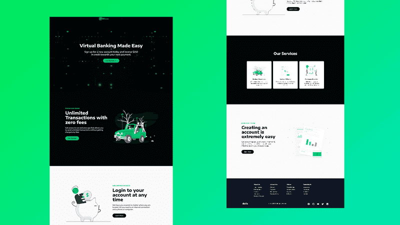
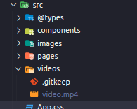

<!-- @format -->



# Virtual Banking

<p align="center">
  

  
  
  <a href="https://github.com/vitorsemidio-dev/virtual-banking-smooth-scroll/commits/master">
    
  </a>
    
   
</p>

Web site responsível e com smooth scroll. O **Smooth Scroll** tornar o deslizar de uma página, uma forma suave, que venha trazer uma melhor experiência ao usuário, para que seja mais agradável a navegação do mesmo pelo site e/ou blog.

As imagens utilizadas neste projetos foram do [Undraw](https://undraw.co/illustrations) e o vídeo do [Pexels Videos](https://www.pexels.com/pt-br/videos/).

**Link Video Aula**: [React Website using Styled Components and Smooth Scroll - Beginner Project Fully Responsive](https://www.youtube.com/watch?v=Nl54MJDR2p8)

## 🛠️ Tecnologias

- React
- React Router Dom
- React Scroll
- Styled Components

## 🧭 Como rodar o projeto

```bash
# Clone este repositório
$ git clone https://github.com/vitorsemidio-dev/virtual-banking-smooth-scroll
```

### Atenção para o vídeo 🛑 ✋

O vídeo utilizando de background da aplicação não está sendo rastreado pelo git para não ocupar um grande espaço no repositório.

Para baixar um vídeos legal, escolhar um no [Pexels Videos](https://www.pexels.com/pt-br/videos/) e salve na pasta `src/videos` com nome **video.mp4**.



Para acessar o mesmo video que usei neste projeto, [clique aqui](https://www.pexels.com/pt-br/video/3130284/).

```bash
# Acesse a pasta do projeto no seu terminal/cmd
$ cd virtual-banking-smooth-scroll

# Instale as dependências
$ yarn install

# Execute a aplicação em modo de desenvolvimento
$ yarn start

# A aplicação será aberta na porta:3000 - acesse http://localhost:3000
```

## 🦸‍♂️ **Autor**

<p>
<kbd>
 
 </kbd>
 <br />
 <sub><strong>🌟 Vitor Emídio 🌟</strong></sub>
</p>

[](https://www.linkedin.com/in/vitorsemidio/)
[](https://github.com/vitorsemidio-dev)
